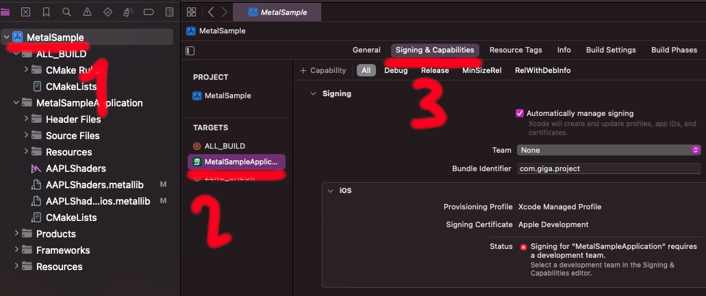
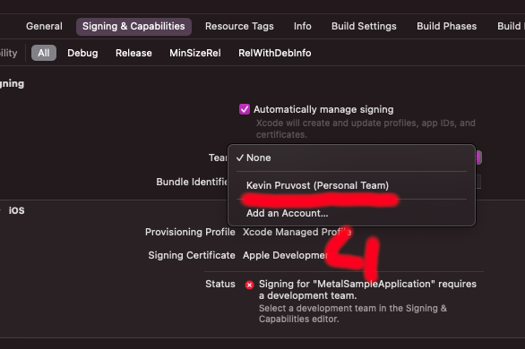
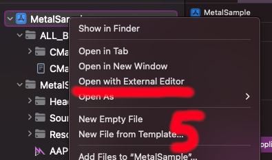
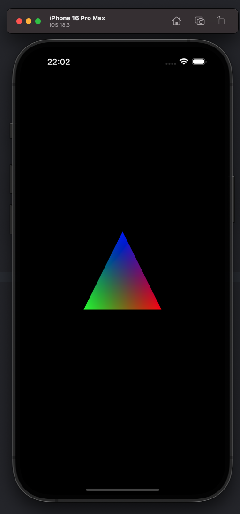
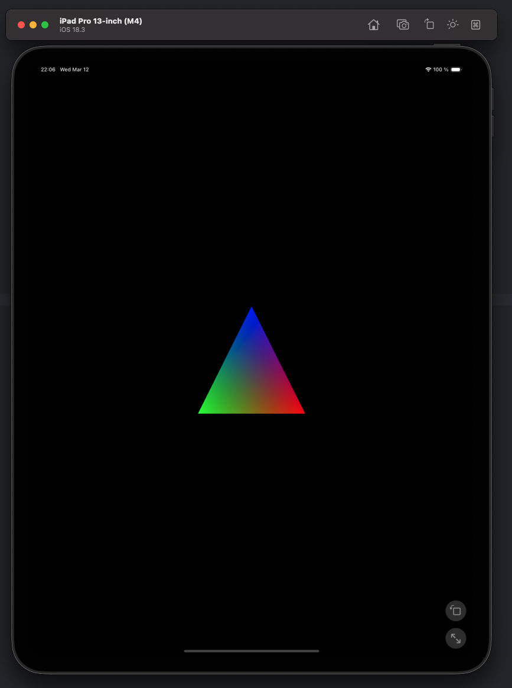
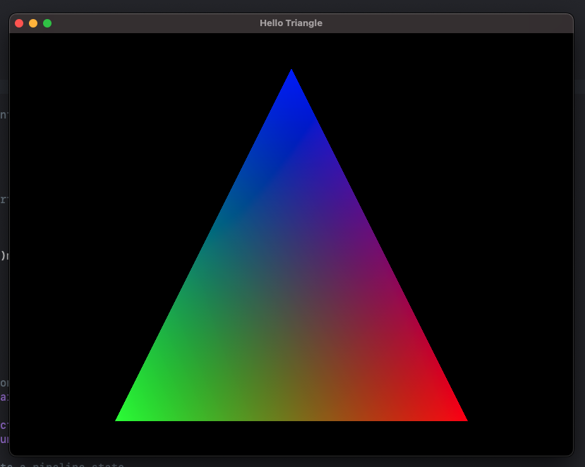

Here’s a cleaner, more structured, and professional-looking **README.md** for your project:

---

# **CMake_iOSmacOS_MetalTemplate**
*A Minimalist Metal App with CMake (C++/Objective-C) and Dynamic Library Linking with Automatic CodeSigning*

## **📌 Overview**
This repository provides a streamlined **Metal App Template** for **iOS and macOS**, built with **CMake**. It simplifies the setup and compilation process, allowing you to quickly get started with Metal development.

### **🚀 Key Features**
✔ **Supports iOS & macOS** using CMake  
✔ **Simplified setup** with minimal configuration  
✔ **Works with physical devices** (iPhones, iPads) effortlessly  
✔ **Based on** [leetal/ios-cmake](https://github.com/leetal/ios-cmake) but **enhanced** for better usability.  
✔ **Automatic Code Signing** 
---

## **📦 Installation & Usage**
### **🔹 1. Clone the Repository**
```sh
git clone https://github.com/yourusername/CMake_iOSmacOS_MetalTemplate.git
cd CMake_iOSmacOS_MetalTemplate
```

### **🔹 2. Setup CodeSign Identity**

#### **🔹 2.a. Finding your CodeSign Identity**


*Method 1*: You can find the **Team ID** in your **Apple Developer Account** under **Membership** in **Certificates, Identifiers & Profiles**.

---

*Method 2*: Or you can also find it in **Xcode** under **Preferences** -> **Accounts** -> **Apple IDs** -> **Team ID**.

---

*Method 3*: Or even better ! You can find it in any XCode Project:

- Open the Xcode project
- Select a target in the **Project Navigator**
- Go to the **Signing & Capabilities** tab
- Find the **Team** dropdown and select your team
- The **Team ID** will be written in the `project.pbxproj` file in the `DEVELOPMENT_TEAM` key.
  - So just open the `project.pbxproj` file (with any IDE/Text editor) and search for `DEVELOPMENT_TEAM` (**Command+Shift+F**) and you will find your **Team ID**. 

| Project Navigator -> Target -> Signing & Capabilities | Pick Team                                        | Searching `DEVELOPMENT_TEAM` in the xcode project files |
|-------------------------------------------------------|--------------------------------------------------|---------------------------------------------------------|
|            |  |               |


#### 🔹 2.b. Setting the CodeSign Identity

**Manually** set the **CodeSign Identity** by creating **CMake/codesign_identity.txt** file and add those lines:

```txt
# codesign_identity.txt
CMAKE_XCODE_ATTRIBUTE_DEVELOPMENT_TEAM=[Your Team ID]
```

### **🔹 3. Generate the Xcode Project**
For **iOS**, **iOS Simulator**, or **macOS**:
```sh
# iOS
make generate_ios
# iOS Simulator
make generate_ios_simulator
# macOS
make generate_macos
```

This will **generate** the Xcode project and **open it automatically**.

### **🔹 4. Run the Metal App**
1. **Select a device** (iPhone, iPad, or Mac)
2. **Press `Cmd + R`** to build and run the project

💡 **Done!** The **Triangle Metal Sample** should now be running on your device.


| Sample run on iOS (iPhone)             | Sample run on iOS (iPad)             | Sample run on macOS                   |
|----------------------------------------|--------------------------------------|---------------------------------------|
|  |  |  |


---

# **📚 Extended CMake Macros & Functions**

| **Macro / Function** | **Description**                                                                                                                                                                                                                                                                                                                                                                                       |
|----------------------|-------------------------------------------------------------------------------------------------------------------------------------------------------------------------------------------------------------------------------------------------------------------------------------------------------------------------------------------------------------------------------------------------------|
| **`set_xcode_property(TARGET, XCODE_PROPERTY, XCODE_VALUE, XCODE_RELVERSION)`** | Sets an **Xcode project property** for a target. Supports **variant-specific** settings (e.g., Debug/Release). If `"All"` is passed, it applies to all configurations.                                                                                                                                                                                                                                |
| **`get_all_dependencies_from_xcode_target(target, out_var)`** | Retrieves **all dependencies** (shared and module libraries) of a given Xcode target and stores them in `out_var`. **Recursively collects dependencies** . Be careful if you plan to link dynamic libraries manually at runtime (*dlopen* if you know what I mean), this macro will surely not link them, add the target names of these libraries before giving **out_var** to **include_frameworks** |
| **`include_frameworks(target, frameworks)`** | Embeds frameworks into the **Xcode project**. Enables **code signing on copy** and ensures they are included in the final build.                                                                                                                                                                                                                                                                      |
| **`include_p_list(target, plist_path)`** | Sets the **Info.plist** file for the target. Required for iOS/macOS apps to define app properties.                                                                                                                                                                                                                                                                                                    |
| **`include_asset_catalog(target, asset_catalog_path)`** | Includes an **asset catalog** (`.xcassets`) into the project. Ensures all assets are copied and properly packaged.                                                                                                                                                                                                                                                                                    |
| **`include_storyboards(target, storyboard_directory)`** | Finds and includes all **storyboard files** (`.storyboard`) from the specified directory. Ensures they are bundled correctly as resources.                                                                                                                                                                                                                                                            |
| **`include_xcode_resource_files(target, resource_files, resource_dir)`** | Adds **custom resource files** to the Xcode project. Ensures they are properly copied and included in the final app bundle.                                                                                                                                                                                                                                                                           |

---
## **🔧 Project Structure**
```
CMake_iOSmacOS_MetalTemplate/
│── src/                   # Source code (C++/Obj-C)
│── CMake/                 # CMake modules
│── Assets/             # Assets, storyboards, etc.
│── CMakeLists.txt         # Main CMake configuration
│── Makefile               # Makefile
│── README.md              
```
---
## **🛠 Makefile Commands**

| Function                                     | Description                                    |
|----------------------------------------------|------------------------------------------------|
| `make generate_ios`                          | Generates the Xcode project for iOS.           |
| `make generate_ios_simulator`                | Generates the Xcode project for iOS simulator. |
| `make generate_macos`                        | Generates the Xcode project for macOS.         |
---

## **📝 License**
This project is open-source and available under the **MIT License**.

---

Let me know if you'd like any adjustments! 🚀

Any Pull Requests are welcome! 🎉